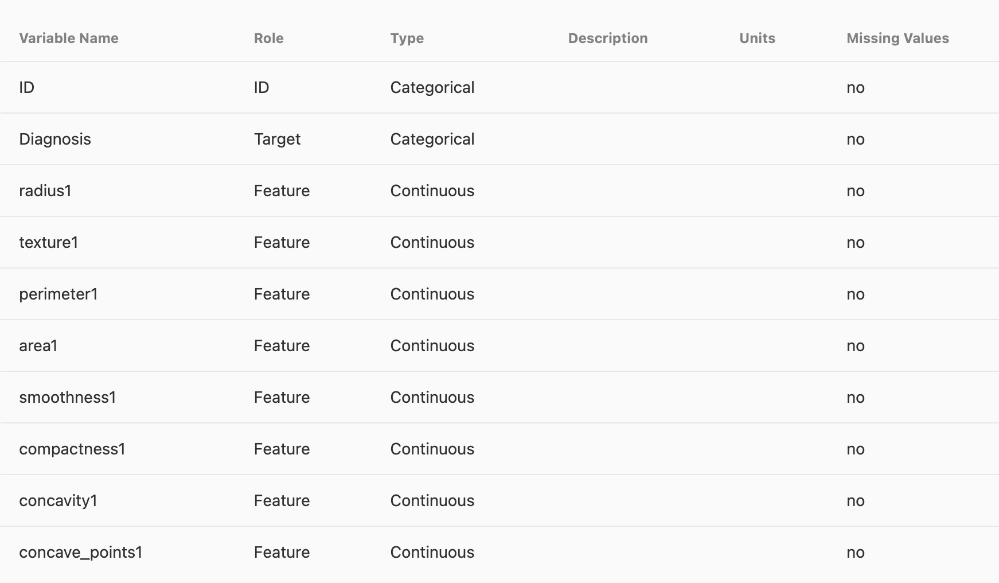
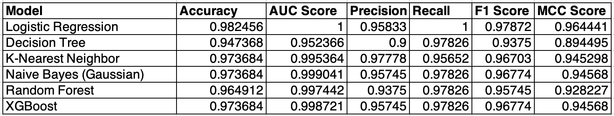
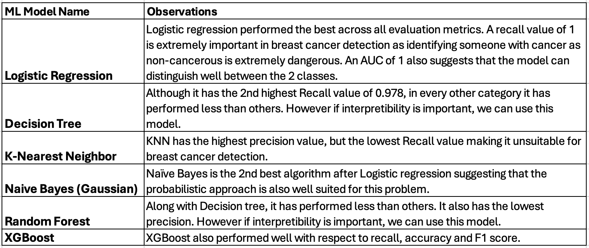
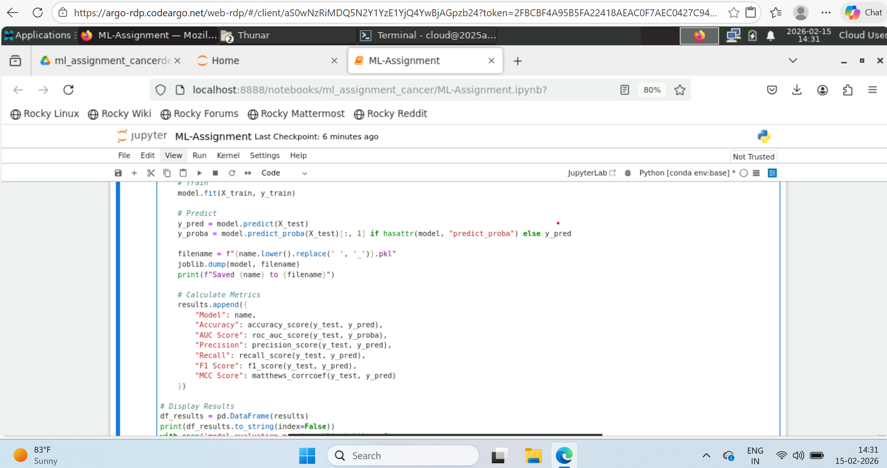
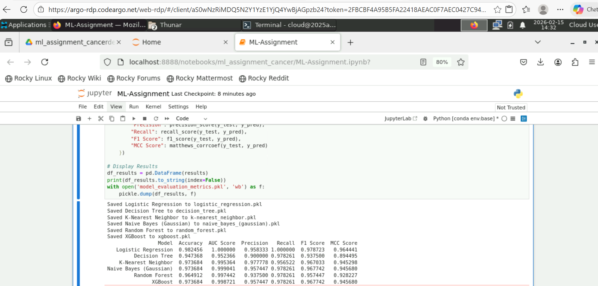
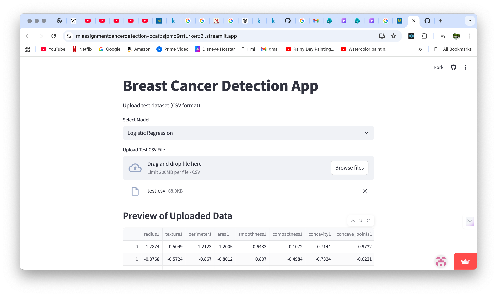
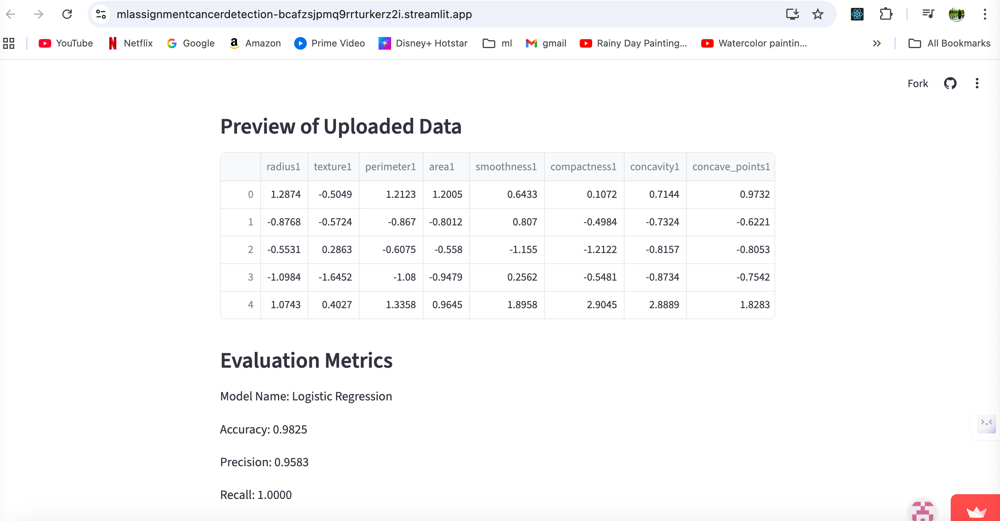
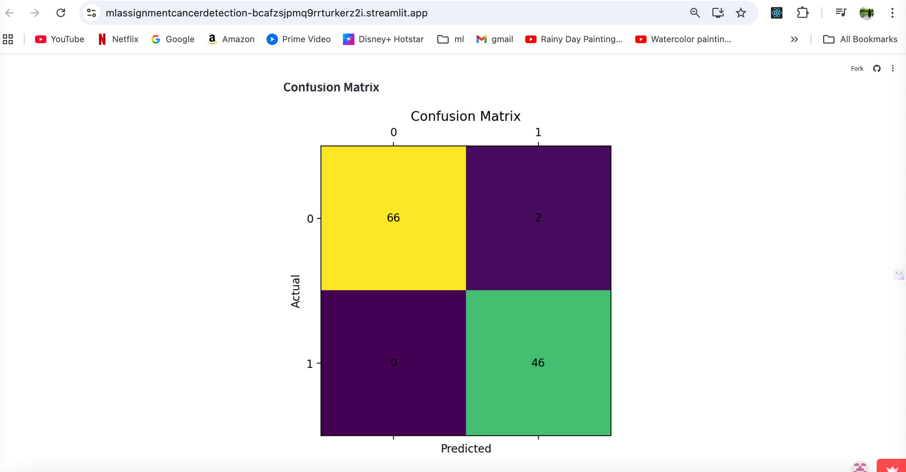

### Problem statement

Identifying whether a tumor in the breast is Malignant or Benign based on the 30 features provided in the dataset. These features include radius, perimeter, texture of the tumor cell among other features.

### Dataset description
Dataset: Breast Cancer Wisconsin (Diagnostic) [https://archive.ics.uci.edu/dataset/17/breast+cancer+wisconsin+diagnostic]

Number of instances: 569

Number of features: 30

### Models used

The Machine Learning Algorithms under consideration are:
- Logistic Regression
- Decision Tree Classifier
- K-Nearest Neighbor Classifier
- Naive Bayes Classifier - Gaussian or Multinomial
- Ensemble Model - Random Forest
- Ensemble Model - XGBoost

### Streamlit url

[ML Assignment – Cancer Detection App](https://mlassignmentcancerdetection-bcafzsjpmq9rrturkerz2i.streamlit.app/)

### Github repo

[ML Assignment – Cancer Detection (GitHub Repository)](https://github.com/2025aa05577-srikanth/ml_assignment_cancerdetection)

### Execution on virtual lab

### Path to test file

You can find the test file to be uploaded into streamlit app under test folder (test.csv).

### Execution on Streamlit cloud

